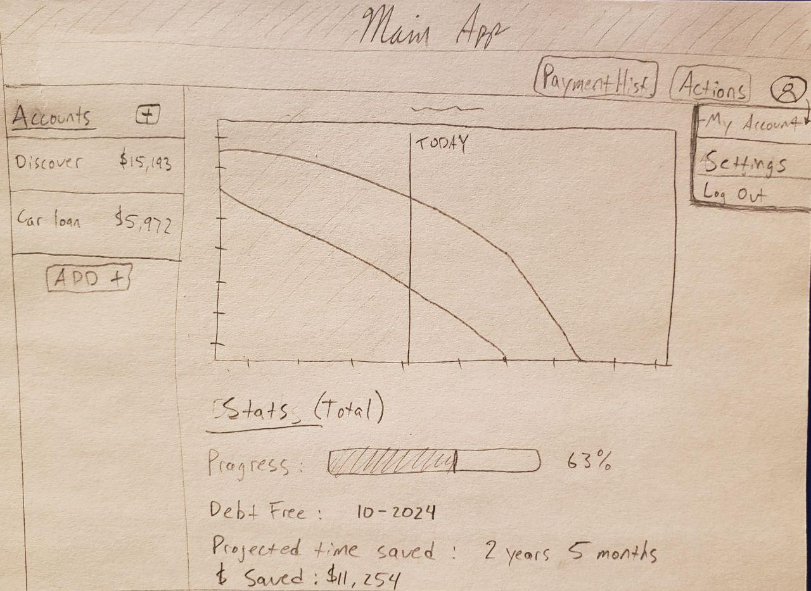
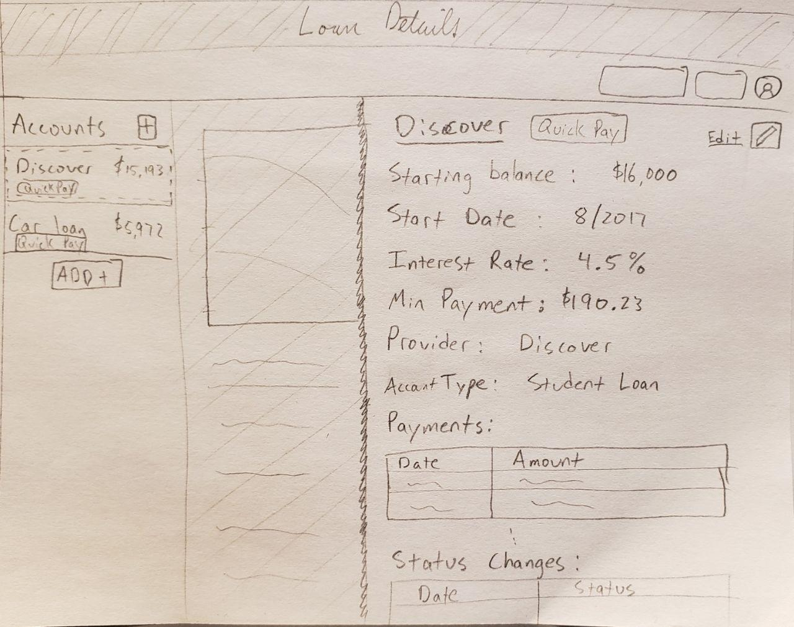

# Make a web app

- [Make a web app](#make-a-web-app)
  - [✔️ 1. Source an idea](#️-1-source-an-idea)
    - [Idea: Debt Paydown Planner (Web App)](#idea-debt-paydown-planner-web-app)
    - [Name ideas](#name-ideas)
  - [✔️ 2. Market research](#️-2-market-research)
    - [Undebt.it keyword competitors](#undebtit-keyword-competitors)
  - [✔️ 3. Define functionality](#️-3-define-functionality)
    - [MVP Features](#mvp-features)
    - [Additional Features](#additional-features)
  - [4. Sketch the web app](#4-sketch-the-web-app)
  - [5. Plan your workflow](#5-plan-your-workflow)
  - [6. Wireframe UI](#6-wireframe-ui)
  - [7. Seek early validation](#7-seek-early-validation)
  - [8. Architect database](#8-architect-database)
    - [Data Structure](#data-structure)
  - [9. Develop frontend](#9-develop-frontend)
    - [Dependencies/Libraries](#dependencieslibraries)
    - [Other](#other)
  - [10. Build backend](#10-build-backend)
    - [Dependencies/Libraries](#dependencieslibraries-1)
  - [11. Host web app](#11-host-web-app)
  - [12. Deploy web app](#12-deploy-web-app)
  - [Beyond the launch](#beyond-the-launch)
    - [Monetize](#monetize)
    - [Notes/Questions](#notesquestions)
    - [Unique selling points](#unique-selling-points)
    - [Goals for the app](#goals-for-the-app)

## ✔️ 1. Source an idea

### Idea: Debt Paydown Planner (Web App)

I have used other web apps and spreadsheets to attempt planning my debt payback. Spreadsheets are flexible enough to give me comparison analysis. Current web apps only provide basic analysis as well. I want to be able to see what different scenarios would produce, see how much money I would save, and dynamically change my plan.

Also, tracking progress is critical to staying the course. I want an app that can give me updates on my plan. I want to set goals and celebrate when I hit milestones. I really want to get invested in crushing my debt!

I came out of college with no idea what I had gotten myself into with the loans I took out. I wanted to have a plan to pay back my loans quickly, but I also wanted to start having kids, save for retirement, and work towards buying a house with my wife.

There are many different approaches to paying back debt. Whatever your approach is, this app will help you plan and commit to paying it down faster.

### Name ideas

- Unslave
- Debt Destroyer
- Debt chomper
- Mountain Climber **\***
- Debt Tool
- Debt Avenger
- Ascent
- Hillside
- Cliff
- Pitch
- Arch
- Mount
- Dynamite
- Debt bomber
- Slope
- Debt dash
- debt.ly
- debto
- paythat
- freedm
- paydown
- pay.it
- crush.it
- debt boom
- debt plow
- committed.io
- commit
- debt grinder
- debt dog -> man-in-debt's best friend
- debt wrangler
- handle.it
- unchain.me **\***
- debt fighter
- debt brawl
- scrappy
- debt demo
- pid (pay it down)
- topple
- linchpin
- fortify
- scheme
- schedge (debt payment schedule)
- ruse (plot)
- stepTwo
- grip
- nitro
- boost
- hustle
- bloodhound
- debt hound

What does debt do to people?

- enslave
- crush
- trap
- ensnare
- weigh down

What do you get when debt is paid?

- freedom
- peace of mind

What is debt compared to?

- Mountains
- Chains
- Anchors, weight

## ✔️ 2. Market research

**Target audience:** FIRE community, College grads, Credit card debtors, etc.

### Undebt.it keyword competitors

- clearcheckbook.com
- unbury.me
- youneedabudget.com
- creditkarma.com
- financialmentor.com
- wellsfargo.com
- bankofamerica.com
- usaa.com
- nerdwallet.com
- barclaycardus.com
- creditsesame.com
- thebalance.com
- daveramsey.com

## ✔️ 3. Define functionality

### MVP Features

- [ ] Add/Remove loans
- [ ] See graph of min. payments (baseline)
- [ ] Select payment method (avalanche, snowball, custom, etc.)
- [ ] Save data (persist sessions)
- [ ] Login/logout
- [ ] View payment history
- [ ] View loan balance history
- [ ] View money saved so far compared to min. payments
  - [ ] Total
  - [ ] Per loan
- [ ] View time saved compared to min. payments
  - [ ] Total
  - [ ] Per loan
- [ ] View total interest paid
  - [ ] Total
  - [ ] Per loan
- [ ] View progress (percentage)
  - [ ] Total
  - [ ] Per Loan
- [ ] Calculate payoff date
  - [ ] Total
  - [ ] Per loan
- [ ] Add additional one-time and scheduled payments
  - [ ] to specific account
  - [ ] to total snowball
- [ ] Add previous payments manually

### Additional Features

- [ ] Modify snowball amount (+/-)
  - [ ] after specific date
  - [ ] select payments periods
- [ ] Line on chart marking current date
- [ ] Print/export payoff plan
- [ ] Group loans together
- [ ] Import/export data
- [ ] Create multiple payment plans
- [ ] Compare payment plans
- [ ] Sync with accounts (like PersonaCapital, Mint, etc.)
- [ ] Milestone notifications
  - [ ] Total progress (10%, 25%, 50%, 75%, 90%, 100%)
  - [ ] Individual loan payoff
  - [ ] Extra paid off
- [ ] Recap and upcoming payment emails
- [ ] Change loan details for select pay periods (interest rate, payment amount, etc.)
- [ ] Mobile app
- [ ] Enter ideal payoff date, get min. monthly payment (based on loans entered)

## 4. Sketch the web app





## 5. Plan your workflow

## 6. Wireframe UI

- Figma

## 7. Seek early validation

## 8. Architect database

Firebase?

### Data Structure

```json
{
  "user": {
    "username": "Brian",
    "email": "bdevries95@gmail.com",
    "lastLogin": "2020-08-01T13:53.221Z"
  },
  "accounts": [
    {
      "id": 1,
      "name": "Discover 192",
      "provider": "Discover",
      "type": "student loan",
      "statusChanges": [
        {
          "status": "deferment",
          "startDate": "2013-08-01T00:00.000Z",
          "endDate": "2017-08-01T00:00.000Z"
        },
        {
          "status": "repayment",
          "startDate": "2017-08-01T00:00.000Z",
          "endDate": "2017-08-01T00:00.000Z"
        }
      ],
      "startDate": "2013-08-01T00:00.000Z",
      "initBalance": 16000,
      "interestRate": 4.5,
      "minPayment": 190.23,
      "payments": [
        {
          "date": "2017-08-01T00:00.000Z",
          "amount": 190,
          "balance": 15810.77
        }
      ]
    }
  ],
  "paymentPlans": [
    {
      "id": 0,
      "name": "Plan 1",
      "method": "snowball",
      "initialSnowball": 1000,
      "plannedPayments": [
        {
          "loanId": 1,
          "date": "2017-08-01T00:00.000Z",
          "interestPaid": 100,
          "principlePaid": 90.23
        }
      ],
      "additionalPayments": [
        {
          "accountId": null,
          "date": "2017-08-01T00:00.000Z",
          "amount": 250
        }
      ]
    }
  ]
}
```

## 9. Develop frontend

### Dependencies/Libraries

- [Vue](https://vuejs.org)
- [Vuex](https://vuex.vuejs.org/)
- [Vue-router](https://router.vuejs.org/)
- [Chart.js](https://chartjs.org)
- UI library
  - [Vuetify](https://vuetifyjs.com/)?

### Other

- Social share icons

## 10. Build backend

### Dependencies/Libraries

- [Firebase](https://firebase.google.com/)
  - Authentication
  - Firestore
- [Axios](https://www.npmjs.com/package/axios)

## 11. Host web app

## 12. Deploy web app

## Beyond the launch

### Monetize

- OPTION 1: Gated features in free version
- OPTION 2: Free trial (14-30 days?)
- OPTION 3 (forever free): self-hosted instance
  - $5-10/month or $50-100/year?

### Notes/Questions

> "My goal is to help you reach your financial goals and forget about this app!"

- **Highlight money saved on interest!**
- **Highlight time saved**
- Problems avoided by using software
  - Lack of accountability
  - Getting off track
  - Outdated spreadsheets
- Benefits
  - Community
  - Stay on track
  - Easily modify plan
  - Compare plans and scenarios
  - Stay motivated!

### Unique selling points

- Enter your "why" as a reminder in the app
- Rewards based system to pay off debt.
- "Link your progress to an enjoyable and repeatable action"
- Compete against others
  - Match up against people with similar pay-off date?
  - Match up against people with similar remaining balance?
- Create a community of debtors and ex-debtors
  - Ask what you're giving up to crush your debt faster
- Gamify debt payment

### Goals for the app

- Overcome the impatience/overwhelm that usually sets in after motivation passes...
- Keep people engaged with their freedom plan and execution

superhuman product market fit

talk to a lot of people! (70-100)
